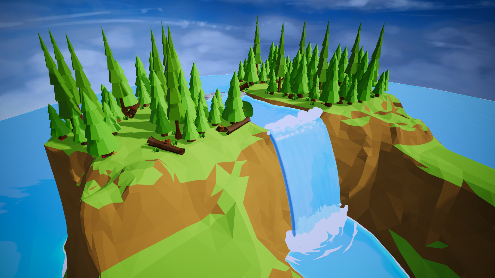
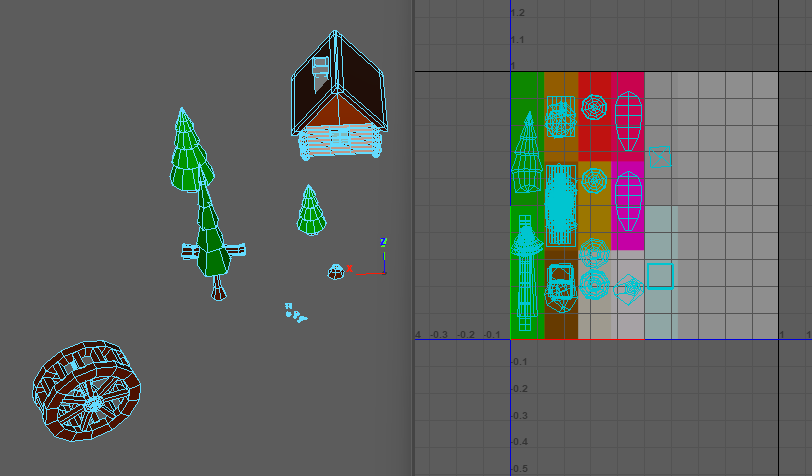
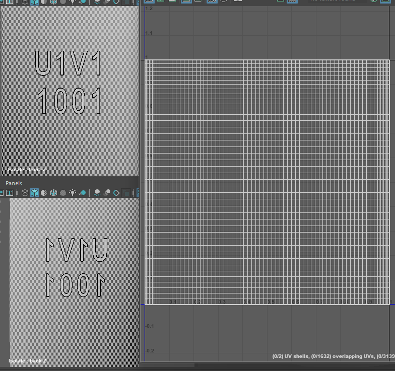

## Introduction
This Waterfall Diorama was created as part of my Year 2.2 module assignment, 3D Environment(3DE), where I was tasked to create this diorama using modular low-poly models with a waterfall present within the diorama.

## Snapshots

    

        <button type="button" data-bs-target="#carouselExampleIndicators" data-bs-slide-to="0" class="active" aria-current="true" aria-label="Slide 1"></button>
        <button type="button" data-bs-target="#carouselExampleIndicators" data-bs-slide-to="1" aria-label="Slide 2"></button>
        <button type="button" data-bs-target="#carouselExampleIndicators" data-bs-slide-to="2" aria-label="Slide 3"></button>
    

    

        

            
            

                Overall Scene
            

        

        

            
            

                Top forest and Waterfall
            

        

        

            
            

                House, Watermill, Trees and Foliage
            

        

    

    <button class="carousel-control-prev" type="button" data-bs-target="#carouselExampleIndicators" data-bs-slide="prev">
        
        Previous
    </button>
    <button class="carousel-control-next" type="button" data-bs-target="#carouselExampleIndicators" data-bs-slide="next">
        
        Next
    </button>

## Breakdown
I will now be doing a breakdown on how I've made certain aspects of this diorama.

### Trees and Foliage
As I was looking for a <mark>Forest</mark> theme for this diorama, multiple low-poly trees and mushrooms were modeled and textured using a single <mark>trimsheet</mark> with only flat colours.

<figure align = "center">
    
    <figcaption align = "center"><b>UV placement for all models</b></figcaption>
</figure>

### Swaying grass
To make the environment look abit more interesting, I placed multiple grass across the diorama that has a shader that displaces each vertices based on a gradient noise value.

As I was unfamiliar with shader programming, I made use of Unity's shader graph to create the shader with the help of [Brackeys Grass Shader](https://www.youtube.com/watch?v=L_Bzcw9tqTc) tutorial.

<figure align = "center">
    
    <figcaption align = "center"><b>Grass Sway Shader Graph</b></figcaption>
</figure>

### Waterfall
The waterfall itself has 2 parts, the shader and the mesh.

#### Shader
Creating the shader itself was pretty straight forward with 3 simple steps:

- Displace each vertices of the mesh based on a `Gradient Noise`
- Lerping the above result with the R channel of the `Vertex Color` as the `T` value to ensure that vertices with red Vertex Color are not displaced.
- Create a normal map using another `Gradient Noise` plugged into the `Normal From Height` node.

<figure align = "center">
    
    <figcaption align = "center"><b>Waterfall Shader Graph</b></figcaption>
</figure>

#### Mesh
The way I have created the waterfall mesh are as follows:

- Extruding a cube and adding multiple subdivisions so that the resulting vertex displacement from the shader does not feel "choppy"
- Unwrapping the UV in such a way that the back portion of the mesh mirrors the front portion since the gradient noise used for the vertex displacement is procedural and not seamless. The mirrored UVs would allow me to "fake" the seamless displacement.

<figure align = "center">
    
    <figcaption align = "center"><b>Waterfall mesh UV layout</b></figcaption>
</figure>

### Interactive Water
The final aspect of the diorama is to add water interaction the moment the player enters the water. By referencing a tutorial created by [MinionsArt](https://www.patreon.com/minionsart), I was able to create the interactive water by writing a <mark>script</mark> and using <mark>Unity's Particle System</mark>.
[Download this documentation](./Interactive%20Water%20Documentation.docx) instead to setup the Interactive Water.

## Additional Resources
[Brackeys Grass Shader](https://www.youtube.com/watch?v=L_Bzcw9tqTc)

[Interactive Water Tutorial](https://www.patreon.com/posts/24192529)