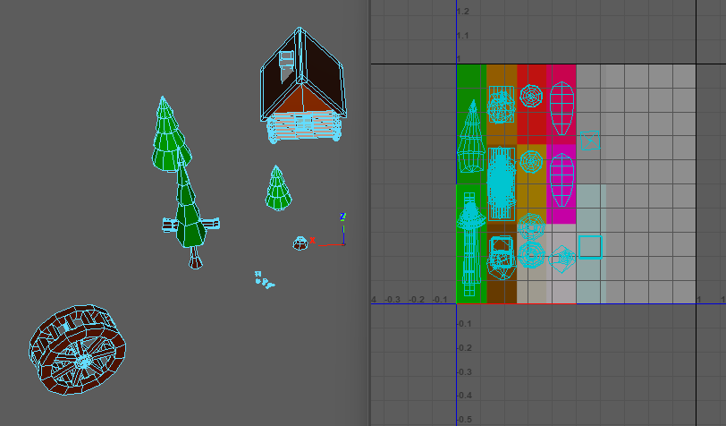
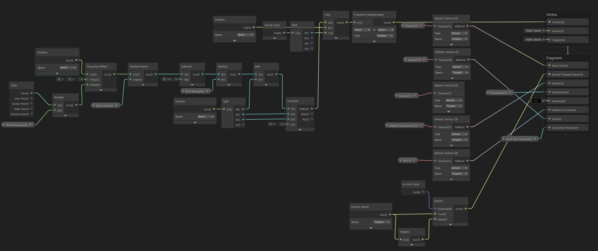
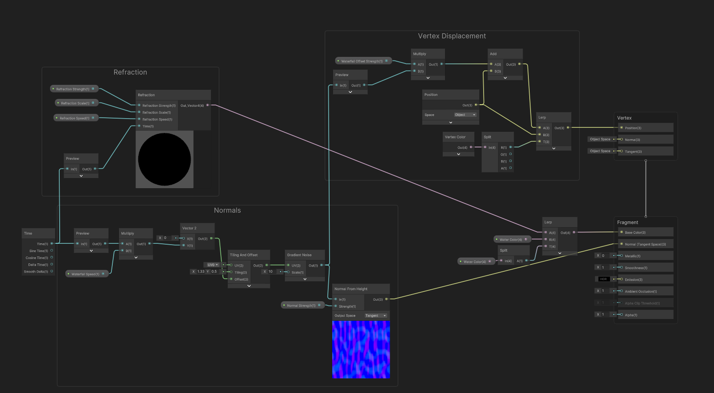

## Introduction
This Waterfall Diorama was created as part of my Year 2.2 module assignment, 3D Environment, where I was tasked to create this diorama using low-poly models with a waterfall present within the diorama.

## Project Overview
I will be going through the important aspects of the project as thoroughly as possible.

### Trees and Mushrooms
As I was looking for a <mark>Forest</mark> theme for this diorama, multiple low-poly trees and mushrooms were modeled and not individually textured. Instead, a <mark>simple trimsheet</mark> with flat colours only was used to texture the models based on their UV placement to the trimsheet itself.

<figure align = "center">
    
    <figcaption align = "center"><b>UV placement for all models</b></figcaption>
</figure>

### Swaying grass
To make the environment look abit more interesting, I placed multiple grass across the diorama that has a shader that displaces each vertices based on the gradient noise value. The shader itself was made in Unity's shader graph with the help of Brackeys tutorial (link in #Additional Resources).

<figure align = "center">
    
    <figcaption align = "center"><b>Grass Sway Shader Graph</b></figcaption>
</figure>

### Waterfall
The waterfall itself has 2 parts, the shader and the mesh.

Creating the shader itself is pretty straight forward. I simply displaced each vertices based on a gradient noise and created a normal map based on a separate gradient noise using the `Normal From Height` node.

I used the R channel of the Vertex Color to ensure that the starting few vertices of the waterfall mesh was not affected by the vertex displacement, ensuring that the waterfall itself is immersive.

<figure align = "center">
    
    <figcaption align = "center"><b>Waterfall Shader Graph</b></figcaption>
</figure>

The mesh was created by extruding a cube and adding multiple subdivisions so that the resulting vertex displacement from the shader does not feel "choppy" in a way. I had to unwrap the UV in such a way that the back portion of the mesh mirrors the front portion since the gradient noise used for the vertex displacement is procedural and not seamless. By mirroring the UVs, I can "fake" the seamless displacement.

<figure align = "center">
    
    <figcaption align = "center"><b>Waterfall mesh UV layout</b></figcaption>
</figure>

### Interactive Water
The final aspect of the diorama is to add water interaction the moment the player enters the water. By referencing a tutorial created by [MinionsArt](https://www.patreon.com/minionsart), I was able to create the interactive water by writing a <mark>script</mark> and using <mark>Unity's Particle System</mark>.
[Download this documentation](./Interactive%20Water%20Documentation.docx) instead to setup the Interactive Water.

## Additional Resources
[Brackeys Grass Shader](https://www.youtube.com/watch?v=L_Bzcw9tqTc)

[Interactive Water Tutorial](https://www.patreon.com/posts/24192529)